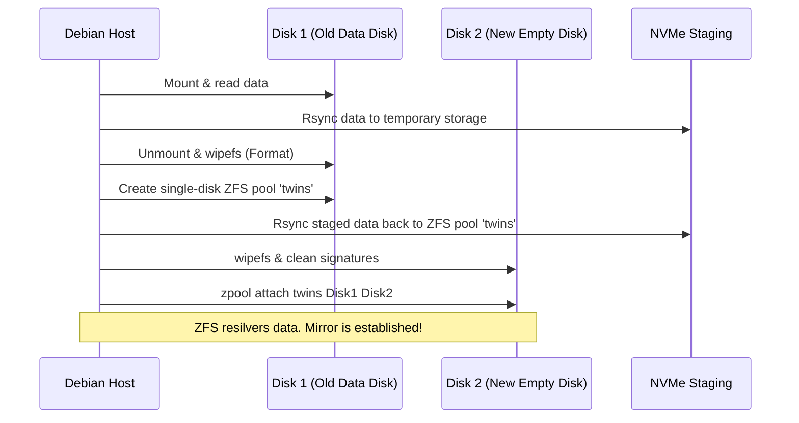

# Storage Management Guide: ZFS, Btrfs, and HDD Migration

This guide outlines advanced storage administration practices on Debian/Proxmox hosts, including Btrfs read-only snapshot management and ZFS HDD migration strategies.

> [!NOTE]
> For a detailed walk-through on creating a ZFS mirror and performing initial data migrations, refer to the [ZFS Migration & Setup Guide].

---

## 1. ZFS Disk Management Cheat Sheet

Essential quick-reference commands for ZFS storage administration.

### Wipe Existing Filesystem Signatures
Ensure clean disk setup before importing/adding to a pool:
```bash
sudo wipefs -a /dev/disk/by-id/<DISK_ID>
```

### Attach Disk to Create a Mirror
Convert a single disk pool to a redundant mirror:
```bash
sudo zpool attach <POOL_NAME> /dev/disk/by-id/<DISK_1_ID> /dev/disk/by-id/<DISK_2_ID>
```

### Monitor Pool Status & Paths
```bash
# Basic view
zpool status

# Show absolute/stable block paths instead of shortnames
zpool status -P
```

### Integrity Scrubbing
Initiate an on-demand data integrity scan:
```bash
sudo zpool scrub twins
```

---

## 2. Btrfs Read-Only Snapshots

Manage read-only system state snapshots when utilizing a Btrfs filesystem setup.

### Create Snapshots
```bash
# Prepare snapshot target directory
sudo mkdir -p /.snapshots

# Generate read-only snapshots
sudo btrfs subvolume snapshot -r / /.snapshots/root-$(date +%F)
sudo btrfs subvolume snapshot -r /opt /.snapshots/opt-$(date +%F)
```
* `-r`: Creates a read-only snapshot, guaranteeing the backup directory cannot be altered without converting the snapshot to read-write.

---

## 3. HDD Migration Strategy (ZFS Mirroring Flow)

If you currently have a single 1TB HDD containing your media (e.g., Immich photos) and want to transition to a ZFS mirror pool safely using a second new 1TB HDD, follow this operational sequence:



### Step-by-Step Execution Plan:
1. **Staging**: Copy all active media from Disk 1 (source) to a temporary NVMe SSD staging folder using `rsync -aHAX --info=progress2`.
2. **First Disk Prep**: Wipe Disk 1 (`wipefs -a /dev/disk/by-id/<DISK_1_ID>`) and create a single-drive ZFS pool named `twins`.
3. **Restoration**: Copy data back from NVMe staging to the new `/twins/` ZFS mount point.
4. **Mirror Creation**: Wipe Disk 2 (`wipefs -a /dev/disk/by-id/<DISK_2_ID>`), then attach it to the pool (`zpool attach twins <DISK_1_ID> <DISK_2_ID>`) to establish the live mirror.
5. **Completion**: Wait for ZFS resilvering to finish (`zpool status twins`). You can now safe-delete the staging files on the NVMe.
