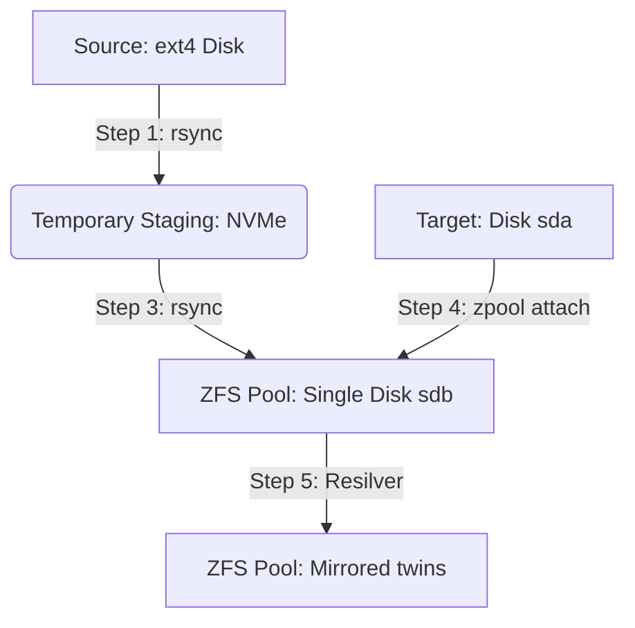

# ZFS Migration & Setup Guide (Debian Homelab)

A comprehensive guide for migrating data from an existing `ext4` filesystem to a resilient ZFS mirror pool on a Debian-based homelab. This document details the step-by-step migration flow, explains the underlying concepts, and provides post-setup optimization and automation recommendations.

---

## 1. Scenario & Architecture Overview

When upgrading storage, you may want to migrate from an old single-disk setup to a mirrored ZFS pool. This guide assumes the following scenario:

* **Source:** An existing disk formatted with `ext4` containing approximately ~300GB of data.
* **Target:** Two 1TB SATA disks designated to form a **ZFS mirror** (RAID-1 equivalent).
* **Staging Area:** An NVMe SSD with sufficient free space (~300GB+) to temporarily hold the data.

### Why use a staging area?
1. **Safety:** Keeps a copy of your source data intact on the NVMe staging disk until the new ZFS pool is verified.
2. **Disk Repurposing:** If the source `ext4` data resided on one of the 1TB drives, staging allows you to wipe that drive, include it in the ZFS pool, and build the mirror without data loss.



---

## 2. Pre-migration Checklist & Verification

Before running any migration commands, identify your disks and install the necessary ZFS utilities.

### Identify Disks and Mountpoints
List all block devices to identify the source and target disks:
```bash
lsblk -o NAME,FSTYPE,SIZE,MOUNTPOINT,UUID
```
Make sure you note down the correct device paths (e.g., `/dev/sda`, `/dev/sdb`).

> [!WARNING]
> Device names like `/dev/sda` and `/dev/sdb` can change after a system reboot. To prevent pool corruption or mount issues, **always use stable disk IDs (`/dev/disk/by-id/`)** when creating or attaching disks in ZFS.

### Install ZFS Utilities
Update your package list and install the ZFS userspace tools:
```bash
sudo apt update
sudo apt install -y zfsutils-linux
```
Verify the ZFS kernel module is loaded:
```bash
lsmod | grep zfs
```

---

## 3. Step-by-Step Data Migration Flow

### Step 1: Copy Source (`ext4`) to Staging (`NVMe`)
Mount your source `ext4` drive and copy all its contents to your temporary NVMe directory.

```bash
sudo rsync -aHAX --info=progress2 /mnt/old/ /nvme-temp/
```

**Rsync Flags Explained:**
* `-a` (archive): Recursively copies files while preserving symlinks, permissions, modification times, group/owner, and special/device files.
* `-H` (hard-links): Preserves hard links.
* `-A` (acls): Preserves Access Control Lists.
* `-X` (xattrs): Preserves extended attributes.
* `--info=progress2`: Displays a single-line, real-time progress update showing total percentage, transfer speed, and remaining time.

---

### Step 2: Create a Single-Disk ZFS Pool
We initialize the pool with a single disk first (`sdb`). We will convert it to a mirror in a later step. 

First, locate the stable ID of your target disk:
```bash
ls -l /dev/disk/by-id/
```
*(Look for the entry corresponding to your disk, e.g., `ata-WDC_WD10EZEX-00WN4A0_WD-WCC6Y1XS7XYZ`)*

Create the pool (named `twins`):
```bash
sudo zpool create -o ashift=12 twins /dev/disk/by-id/<DISK_1_ID>
```

**Parameters Explained:**
* `zpool create`: Command to initialize a new ZFS storage pool.
* `-o ashift=12`: Sets the block size to $2^{12}$ (4KB). This is critical for modern Advanced Format (AF) drives to ensure optimal performance and prevent write amplification.
* `twins`: The name of your new pool.
* `/dev/disk/by-id/<DISK_1_ID>`: The stable disk path for your first 1TB target drive.

By default, ZFS will automatically mount this new pool at `/twins`.

---

### Step 3: Copy Data from Staging (`NVMe`) to ZFS
Copy the staged data onto your newly created ZFS pool.

```bash
sudo rsync -aHAX --info=progress2 /nvme-temp/ /twins/
```

> [!TIP]
> Ensure the trailing slash `/` is present on both `/nvme-temp/` and `/twins/` to copy the *contents* of the directory rather than the directory container itself.

---

### Step 4: Create the Mirror (Attach Second Disk)
Now that your data is safe on the ZFS pool, wipe the second disk (`sda`) to clear any old filesystem signatures, and attach it to the pool to establish the mirror.

Wipe filesystem signatures on the second disk:
```bash
sudo wipefs -a /dev/disk/by-id/<DISK_2_ID>
```

Attach the second disk to convert the single-disk pool into a two-disk mirror:
```bash
sudo zpool attach twins /dev/disk/by-id/<DISK_1_ID> /dev/disk/by-id/<DISK_2_ID>
```

**Parameters Explained:**
* `zpool attach`: Instructs ZFS to attach a new device to an existing vdev, converting a single-disk vdev into a mirror.
* `twins`: The target pool name.
* `<DISK_1_ID>`: The identifier of the existing disk in the pool.
* `<DISK_2_ID>`: The identifier of the new disk to attach.

---

### Step 5: Monitor the Resilvering Process
ZFS will automatically begin copying and syncronizing data to the newly attached disk. This process is called **resilvering**.

Monitor the resilvering progress and pool health:
```bash
zpool status twins
```
You will see a status screen showing the progress percentage, estimated time remaining, and status of both disks.

---

## 4. Understanding Critical ZFS Concepts

### Resilvering vs. RAID Rebuilds
Traditional hardware or software RAID (like RAID-5 or RAID-1) rebuilds by copying every block from the source disk to the target disk, regardless of whether those blocks contain actual files or empty space.

* **ZFS Resilver:** ZFS is filesystem-aware. It only copies **allocated blocks (actual data)**. If your 1TB drive only has 300GB of data, ZFS will only write 300GB. This makes rebuilds faster and reduces stress on the drives.
* **Metadata Checksums:** During resilvering, ZFS verifies the cryptographic checksums of all data. If it encounters a read error on one drive, it uses the checksums to identify the corruption and repairs it using the good copy on the mirror.

### ZFS Mounting Behavior (No `/etc/fstab`)
Unlike traditional Linux filesystems (ext4, XFS), ZFS does not rely on `/etc/fstab` to mount directories at boot. 
* ZFS maintains its own mount configurations.
* When the ZFS system service starts at boot, it imports the pools and automatically mounts them based on their ZFS property configurations.

#### Listing Mountpoints
To see where your ZFS datasets are mounted:
```bash
zfs get mountpoint
```

#### Changing a Mountpoint
If you want to mount your pool elsewhere (for example, `/data` instead of `/twins`):
```bash
sudo zfs set mountpoint=/data twins
```

---

## 5. Post-Setup Tuning & Best Practices

To optimize performance and extend the lifetime of your drives, apply these standard ZFS pool modifications:

### 1. Enable Compression
ZFS handles compression in-flight with minimal CPU overhead. Enabling it saves space and can speed up disk I/O.
```bash
sudo zfs set compression=lz4 twins
```
* `lz4` is the recommended default compression algorithm due to its high speeds and low CPU footprint.

### 2. Disable Access Time Updates (`atime`)
By default, Linux writes to the disk every time a file is read to update its access time. Disabling this avoids unnecessary write cycles.
```bash
sudo zfs set atime=off twins
```

### 3. Adjust Recordsize (Optional)
ZFS uses a default block size (`recordsize`) of 128KB. You can tune this dataset-by-dataset depending on the type of files stored:
* For database engines (e.g., PostgreSQL/MySQL), match the page size (typically 8KB or 16KB).
* For large media streaming files, increase it to 1MB to optimize sequential reads:
  ```bash
  sudo zfs set recordsize=1M twins
  ```

---

## 6. Automation: Monthly Scrubbing

A ZFS **scrub** checks all data blocks in the pool against their metadata checksums to detect and automatically repair silent data corruption ("bit rot"). It is highly recommended to run a scrub once a month.

### Option A: systemd Service and Timer (Recommended)
This is the modern and robust way to automate tasks in Debian.

1. **Create the systemd Service File:**
   ```bash
   sudo nano /etc/systemd/system/zfs-scrub.service
   ```
   Paste the following configuration:
   ```ini
   [Unit]
   Description=ZFS Scrub Pool twins
   Documentation=man:zpool-scrub(8)
   ConditionPathExists=/sys/module/zfs

   [Service]
   Type=oneshot
   ExecStart=/usr/sbin/zpool scrub twins
   ```

2. **Create the systemd Timer File:**
   ```bash
   sudo nano /etc/systemd/system/zfs-scrub.timer
   ```
   Paste the configuration to trigger the scrub on the **first Sunday of every month at 3:00 AM**:
   ```ini
   [Unit]
   Description=Monthly ZFS Scrub Timer

   [Timer]
   OnCalendar=Sun *-*-01..07 03:00:00
   Persistent=true

   [Install]
   WantedBy=timers.target
   ```

3. **Enable and Start the Timer:**
   ```bash
   sudo systemctl daemon-reload
   sudo systemctl enable --now zfs-scrub.timer
   ```

4. **Verify the Timer status:**
   ```bash
   systemctl list-timers --all | grep zfs-scrub
   ```

---

### Option B: Cron Job (Legacy)
If you prefer standard cron:
```bash
sudo crontab -e
```
Add the following line to run the scrub at 3:00 AM on the first Sunday of the month:
```cron
0 3 1-7 * * [ $(date +\%u) -eq 7 ] && /usr/sbin/zpool scrub twins
```

---

## 7. Basic Pool Operations Cheat Sheet

### Exporting a Pool (Safe Detach)
Before removing disks or reinstalling the host OS, export the pool to flush all caches and write clean state markers:
```bash
sudo zpool export twins
```

### Importing a Pool
When moving disks to a new system or recovering an OS:
```bash
sudo zpool import -d /dev/disk/by-id twins
```
* The `-d` flag tells ZFS to look for the disks inside `/dev/disk/by-id`, enforcing the use of stable disk IDs instead of short names (`/dev/sdX`).

### Recovering/Importing a Pool with short names to stable IDs
If you originally created a pool using short names like `/dev/sdb`, you can convert it to use stable IDs by exporting it and importing it using the stable ID directory:
```bash
sudo zpool export twins
sudo zpool import -d /dev/disk/by-id twins
```

### Monitor Pool Health
```bash
zpool status
zpool list
zfs list
```
